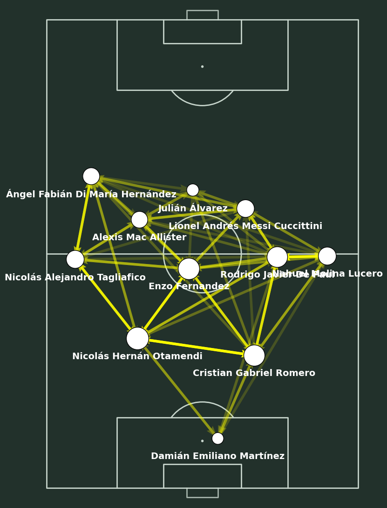
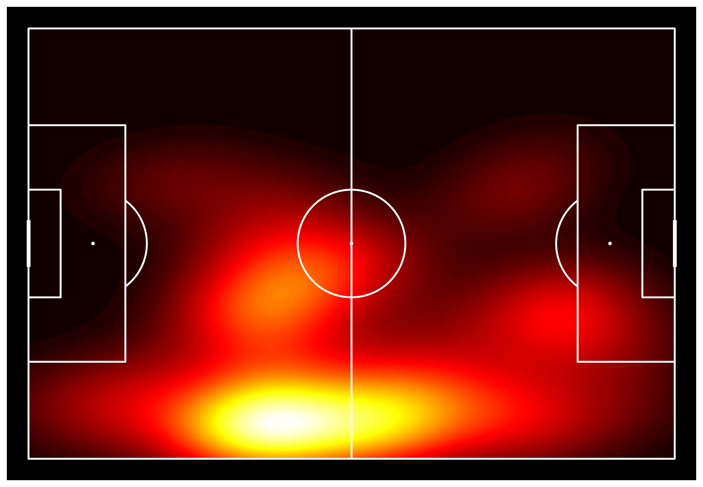
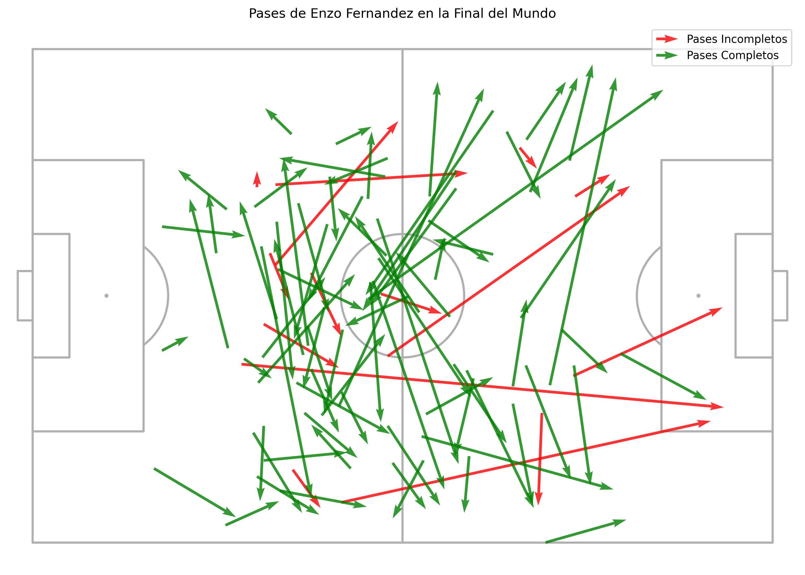

  

  # IAO Football Analytics

  **Football Data Analyst & Analytics Engineer**
  *Arquitectura de Datos · Automatización · BI aplicado al Fútbol*

  
  

## Sobre este proyecto

**IAO Football Analytics** es mi laboratorio de **Football Data Science**. 
El enfoque de este repositorio no es únicamente el análisis de rendimiento táctico, sino el diseño e implementación de **Data Pipelines** escalables. Construyo sistemas modulares que transforman datos crudos (Scraping, APIs) en inteligencia deportiva accionable orientada a clubes, departamentos de scouting y cuerpos técnicos.

---

## Estructura del repositorio

Este repositorio está organizado de forma modular:

- `data/` → datasets crudos o procesados  
- `notebooks/` → análisis exploratorios y visualizaciones  
- `src/` → scripts reutilizables en Python  
- `outputs/` → imágenes generadas (mapas, gráficos, reportes)  
- `workflow/` → automatizaciones exportadas desde n8n  

---

## Tech Stack

### Data Architecture & Extraction

### ETL & Data Processing

### Visualization, Dashboards & Video

---

## Data Pipelines & Proyectos Destacados

### 1. Serie A Analysis Pipeline
Implementación de un flujo ETL modular para la liga italiana, priorizando la inmutabilidad de los datos originales y la automatización de métricas.
* **Estructura del Data Flow:** Extracción automatizada (`00_scraping`) → Limpieza y aplicación de lógica táctica (`01_limpiar_analizar`) → Integración dinámica de assets visuales mediante Pillow.

### 2. Mundial 2022 (StatsBomb Open Data)
Procesamiento masivo de eventos para el análisis de progresión, circuitos de pases y distancias al arco rival utilizando la API de StatsBomb.

### 3. Eficiencia Goleadora (Understat)
Sistema de extracción automatizada para evaluar métricas de xG (Expected Goals) y rendimiento ofensivo.

---

## Arquitectura del Repositorio

El diseño garantiza la escalabilidad del sistema y la reproducibilidad técnica:

* `proyecto_serie_a/` → Pipeline ETL completo y documentado.
* `data/`
    * `raw/` → Datasets crudos inmutables (Single Source of Truth).
    * `cleaned/` → Datos normalizados y procesados para consumo.
* `notebooks/` → Entornos de experimentación y análisis exploratorio.
* `src/` → Scripts modulares en Python para reutilización funcional.
* `outputs/` → Entregables visuales listos para reporte a cuerpo técnico.
* `workflow/` → Automatizaciones y orquestación exportadas desde n8n.
* `escudos/` → Repositorio local de assets estáticos (logos PNG).

---

## Modelos Analíticos y Visuales

Exploración interactiva de los modelos de inteligencia táctica desarrollados:

* **Mapas de pases (Red de conexiones)** 
* **Mapas de calor (Zonas de influencia)** 
* **Scatter de pases con direccionalidad (Flechas)** 
* **Efectividad defensiva** 
* **Análisis Mundial 2022 (StatsBomb)** 
* **Eficiencia Goleadora (Understat - Web Scraping)** [Abrir notebook localmente](notebooks/plantilla_understat_pro.ipynb)

<b>Ver ejemplos de visualizaciones generadas</b>

 

**Mapa de pases** 

**Heatmap – Rodrigo De Paul** 

**Scatter de pases con flechas** 

---

## Automatización (n8n)

Integración de flujos de trabajo autónomos para optimizar tiempos de scouting y análisis:
- Obtención programada de datos desde APIs deportivas.
- Limpieza inicial y parseo de eventos JSON.
- Almacenamiento directo y estructurado en el directorio `/data`.
- *Workflow disponible para importación en:* `workflow/obtencion_datos_futbol.json`

---

#### Web Scraping y Sourcing de Datos
* **Libraries:** `BeautifulSoup`, `Selenium`, `requests`.
* **Advanced Sourcing:** `soccerdata` (Integración con Understat, FBRef, WhoScored).

---

## Próximos Pasos

- Integración de métricas avanzadas mediante modelos de Machine Learning.
- Automatización de reportes post-partido (PDF generados dinámicamente) distribuidos vía n8n.
- Despliegue de Dashboards interactivos alojados en la nube.

---

## Autor

**Israel Oyhenart**  
Analista de Datos aplicado al Fútbol

LinkedIn:  
https://www.linkedin.com/in/israel-oyhenart

---

Este repositorio tiene fines de aprendizaje y desarrollo profesional.

